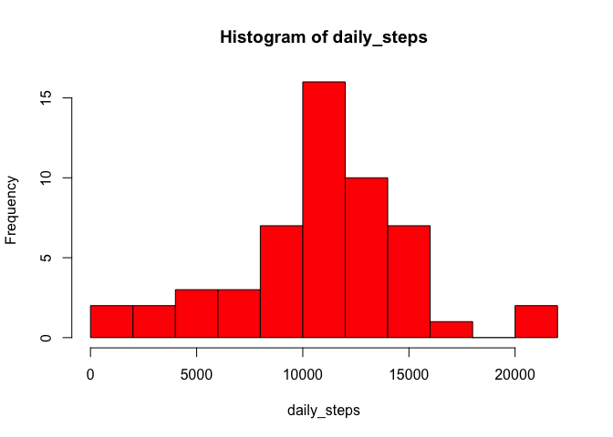
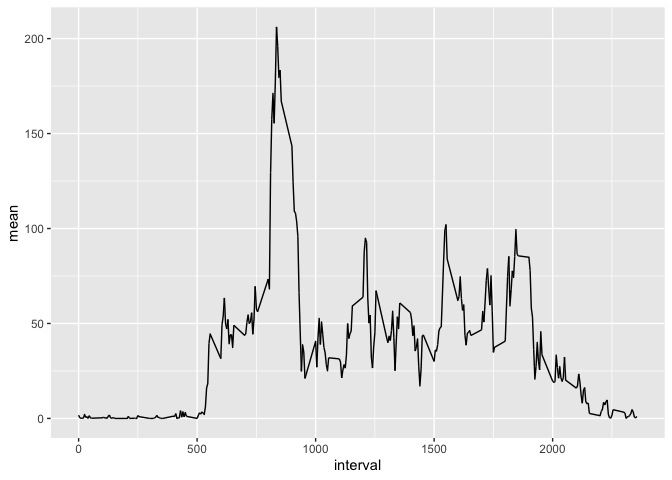
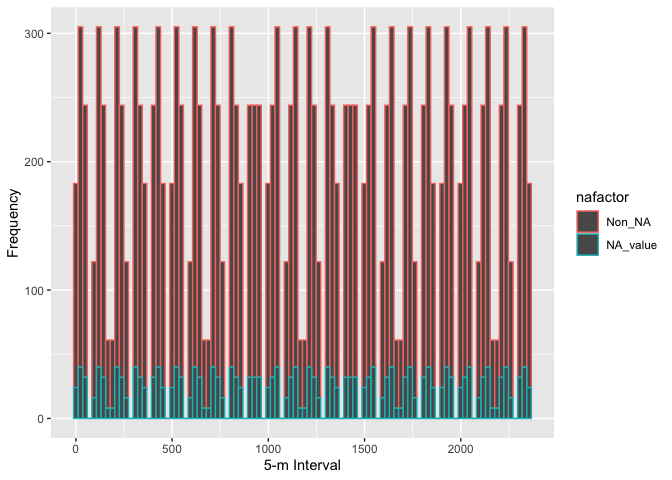
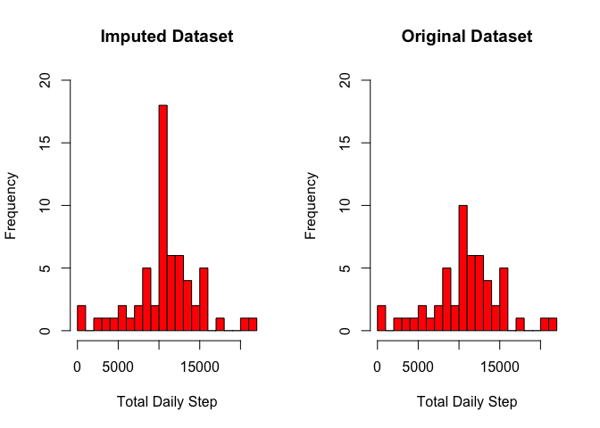
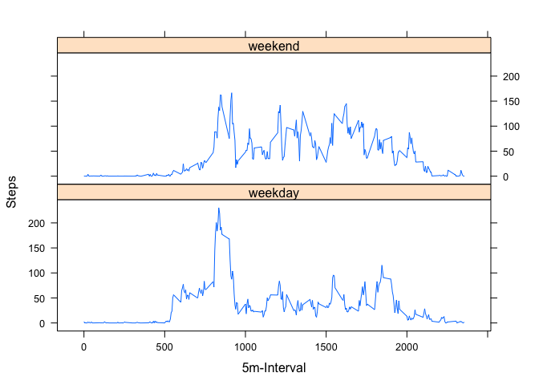

## Loading and preprocessing the data

```r
library(ggplot2)
library(lattice)
activity <- read.csv("activity.csv")
str(activity)
```

```
## 'data.frame':	17568 obs. of  3 variables:
##  $ steps   : int  NA NA NA NA NA NA NA NA NA NA ...
##  $ date    : Factor w/ 61 levels "2012-10-01","2012-10-02",..: 1 1 1 1 1 1 1 1 1 1 ...
##  $ interval: int  0 5 10 15 20 25 30 35 40 45 ...
```

```r
activity$date <- as.Date(activity$date, "%Y-%m-%d") 
```

## What is mean total number of steps taken per day?

```r
daily_steps <- tapply(activity$steps, activity$date, sum)
hist(daily_steps, breaks = 15, col = "red")
```

<!-- -->

```r
mean(daily_steps, na.rm = TRUE)
```

```
## [1] 10766.19
```

```r
median(daily_steps, na.rm = TRUE)
```

```
## [1] 10765
```

## What is the average daily activity pattern?

```r
activity$mean <- tapply(activity$steps, activity$interval, mean, na.rm = TRUE)
qplot(interval, mean, data = activity, geom = "line")
```

<!-- -->


The 5-minute interval, on average across all the days in the dataset, contains the maximum number:

```r
sub <- activity[max(activity$mean) == activity$mean,]; sub[which.max(sub$steps),]
```

```
##      steps       date interval     mean
## 4136   786 2012-10-15      835 206.1698
```

## Imputing missing values
Looking at the data to see if there is any pattern to the NA values:

```r
activity$nafactor <- as.factor(is.na(activity$steps))
levels(activity$nafactor) <- c("Non_NA", "NA_value")
qplot(interval, data = activity, col =  nafactor, bins = 100, xlab = "5-m Interval", ylab = "Frequency")
```

<!-- -->

It shows from plotting the intervals with the na values *true* and the ones with non-NA values *false* that there is a clear patern between both, an appearing linear corelation.  

The total number of NAs is:

```r
sum(is.na(activity$steps))
```

```
## [1] 2304
```

To fill the NAs:

```r
imp_data = activity

for(i in 1:nrow(imp_data))
{
  if(is.na(imp_data$steps[i])){
    imp_data$steps[i] = imp_data$mean[i]
  }
}
```

to compare both datasets

```r
par(mfrow = c(1,2))
hist(tapply(imp_data$steps,as.factor(imp_data$date), sum), col = "red", breaks = 30, ylim = c(0,20), main = "Imputed Dataset",  xlab = "Total Daily Step" )
hist(tapply(activity$steps,as.factor(activity$date), sum), col = "red", breaks = 30, ylim = c(0,20),  main = "Original Dataset", xlab = "Total Daily Step" )
```

<!-- -->

It appears that the imputed data resembles the orginal data distripution with an increase in frequency across all days.

## Are there differences in activity patterns between weekdays and weekends?

To create a new factor called week_day_end:


```r
weekdays <- weekdays(imp_data$date)
for(i in 1:nrow(imp_data))
{
  if(weekdays[i] == "Saturday" | weekdays[i] == "Sunday")
  {
    imp_data$week_day_end[i] <- "weekend"
  }
  else
  {
    imp_data$week_day_end[i] <- "weekday"
  }
}
imp_data$week_day_end <- as.factor(imp_data$week_day_end)
```


Now to get the mean of according to the weedday-weekend factor and to plot the level of activity on weekdays and on weekends: 


```r
daily_steps = aggregate(steps ~ interval + week_day_end, data = imp_data, mean)
xyplot(steps ~ interval | week_day_end, daily_steps, type = "l", layout = c(1, 2), xlab = "5m-Interval", ylab = "Steps")
```

<!-- -->


